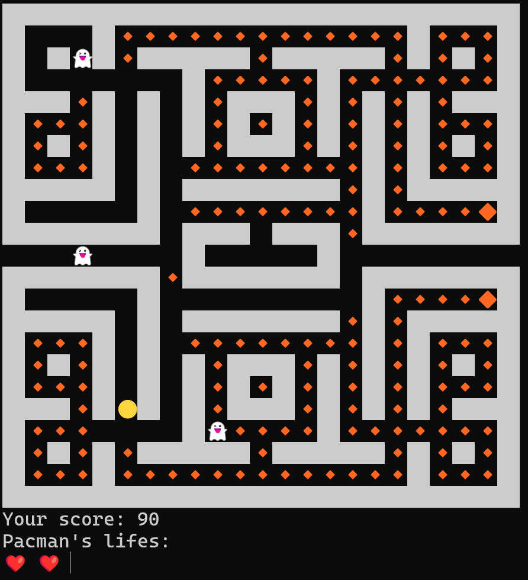

# pacman_fsharp

Console Pac-Man written in F# — Lab 4 for the "Functional Programming" course.

Preview:


## Requirements

- [.NET SDK 8.0](https://dotnet.microsoft.com/download/dotnet/8.0)

## Running

```bash
dotnet run
```

The game needs a terminal with Unicode (UTF-8) output support — `Program.fs` switches the
output encoding to `Encoding.Unicode`, so emoji in the field will not render in legacy
code pages (e.g. Windows Console with codepage 866).

## Controls

| Key | Action |
| --- | --- |
| `↑` | Move up |
| `↓` | Move down |
| `←` | Move left |
| `→` | Move right |

Input is polled non-blockingly once per tick (200 ms), so the field keeps redrawing while you
hold a key. At the end of a game press `Y` to restart or `N` to quit.

## Rules

- Pac-Man starts with 3 lives.
- 🔸 small apple: **+1** score.
- 🔶 big apple: **+10** score and turns all ghosts edible for 50 ticks.
- 👻 edible ghost: **+100** score, the ghost then respawns at its home tile.
- 👻 ghost caught while not edible: one life is lost.
- The game is over when lives reach 0.

## Field legend

| Symbol | Meaning |
| --- | --- |
| `██` | Wall |
| `🔸` | Small apple |
| `🔶` | Big apple (power-up) |
| `🟡` | Player |
| `👻` | Ghost |
| `👾` | Edible ghost |
| `❌` | Death screen overlay |
| `❤️` | One remaining life |
| `--` | Ghost house door |

Left/right edges of the field wrap around to the opposite side.

## Project layout

| File | Contents |
| --- | --- |
| `Maze.fs` | Symbol constants and the maze matrix. |
| `Game.fs` | Game state, movement, AI, scoring and the main `run` loop. |
| `Program.fs` | Entry point; sets the console encoding and starts the game. |
